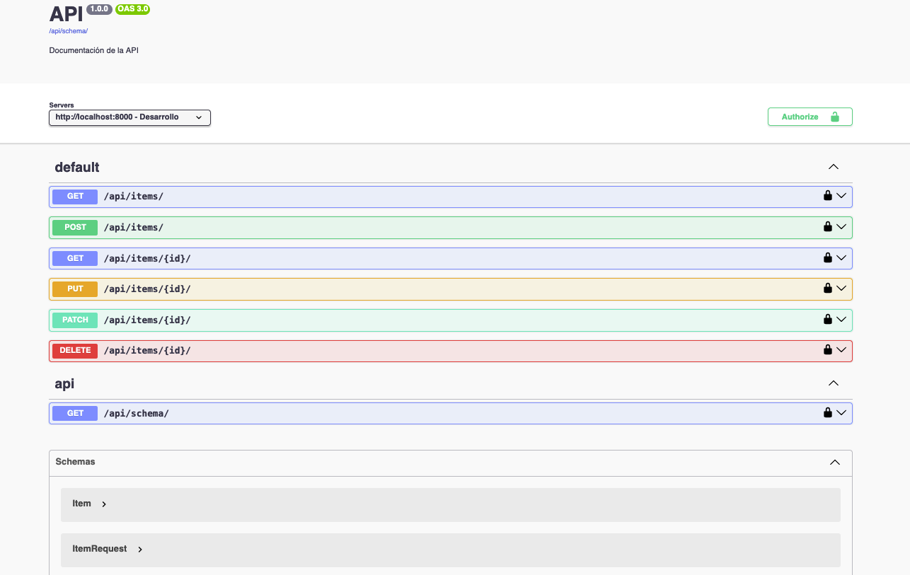

# Api con Django REST Framework (DRF)
API moderna con Django REST Framework, enfocada en buenas prácticas y seguridad.
CRUD con ModelViewSet, filtros/búsqueda/orden, paginación y CORS configurado.
Documentación OpenAPI con drf-spectacular (Swagger/Redoc) y Browsable API con login.



### 1. Requisitos e instalación

```bash
python -m venv env
source env/bin/activate  # en Windows: env\Scripts\activate
pip install django djangorestframework django-cors-headers drf-spectacular django-filter
```

### 2. Crear proyecto

```bash
django-admin startproject core .
python manage.py startapp api
```

### 3. Configuración (`core/settings.py`)

```python
INSTALLED_APPS = [
    'django.contrib.admin', 'django.contrib.auth', 'django.contrib.contenttypes',
    'django.contrib.sessions', 'django.contrib.messages', 'django.contrib.staticfiles',
    'rest_framework', 'drf_spectacular', 'corsheaders', 'api',
]

MIDDLEWARE = [
    'corsheaders.middleware.CorsMiddleware',
    'django.middleware.common.CommonMiddleware',
    # ... otros middlewares
]

CORS_ALLOWED_ORIGINS = [
    'http://localhost:3000',
    'http://127.0.0.1:3000',
]

REST_FRAMEWORK = {
    'DEFAULT_SCHEMA_CLASS': 'drf_spectacular.openapi.AutoSchema',
}

SPECTACULAR_SETTINGS = {
    'TITLE': 'API',
    'DESCRIPTION': 'Documentación de la API',
    'VERSION': '1.0.0',
    'SCHEMA_PATH_PREFIX': r'/api/(?!schema|docs|redoc).*',
    'SERVERS': [{'url': 'http://localhost:8000', 'description': 'Desarrollo'}],
    'COMPONENT_SPLIT_REQUEST': True,
}
```

### 4. Modelo (`api/models.py`)

```python
from django.db import models

class Item(models.Model):
    nombre = models.CharField(max_length=100)
    telefono = models.CharField(max_length=20)
    creado = models.DateTimeField(auto_now_add=True)
    actualizado = models.DateTimeField(auto_now=True)

    def __str__(self):
        return f"{self.nombre} - {self.telefono}"
```

### 5. Serializador (`api/serializers.py`)

```python
from rest_framework import serializers
from .models import Item

class ItemSerializer(serializers.ModelSerializer):
    class Meta:
        model = Item
        fields = ['id', 'nombre', 'telefono', 'creado', 'actualizado']
        read_only_fields = ['id', 'creado', 'actualizado']
```

### 6. Vista y filtros (`api/views.py`)

```python
from rest_framework import viewsets
from .models import Item
from .serializers import ItemSerializer

class ItemViewSet(viewsets.ModelViewSet):
    queryset = Item.objects.all()
    serializer_class = ItemSerializer
    filterset_fields = ['nombre', 'telefono', 'creado', 'actualizado']
    search_fields = ['nombre', 'telefono']
    ordering_fields = ['creado', 'actualizado', 'nombre']
    ordering = ['-creado']
```

### 7. Rutas (`api/urls.py` y `core/urls.py`)

```python
# api/urls.py
from rest_framework.routers import DefaultRouter
from .views import ItemViewSet

router = DefaultRouter()
router.register(r'items', ItemViewSet, basename='item')
urlpatterns = router.urls
```

```python
# core/urls.py
from django.contrib import admin
from django.urls import path, include
from drf_spectacular.views import SpectacularAPIView, SpectacularSwaggerView, SpectacularRedocView

urlpatterns = [
    path('admin/', admin.site.urls),
    path('api/', include('api.urls')),
    path('api-auth/', include('rest_framework.urls', namespace='rest_framework')),
    path('api/schema/', SpectacularAPIView.as_view(), name='schema'),
    path('api/docs/', SpectacularSwaggerView.as_view(url_name='schema'), name='swagger-ui'),
    path('api/redoc/', SpectacularRedocView.as_view(url_name='schema'), name='redoc'),
]
```

### 8. Migrar y arrancar

```bash
python manage.py makemigrations
python manage.py migrate
python manage.py createsuperuser  # opcional, para admin y permisos del Browsable API
python manage.py runserver
```

### 9. Uso rápido

- Browsable API: http://127.0.0.1:8000/api/items/
- Login Browsable API: http://127.0.0.1:8000/api-auth/login/
- CRUD:
  - GET/POST: /api/items/
  - GET/PUT/PATCH/DELETE: /api/items/{id}/
- Filtros: `/api/items/?nombre=Juan&telefono=5551234`
- Búsqueda: `/api/items/?search=ropa`
- Orden: `/api/items/?ordering=-creado`
- Paginación: `/api/items/?page=1`

Ejemplo creación:

```bash
curl -X POST http://127.0.0.1:8000/api/items/ \
  -H 'Content-Type: application/json' \
  -d '{"nombre":"lavar ropa","telefono":"534534534"}'
```

### 10. Documentación OpenAPI

- Esquema: http://127.0.0.1:8000/api/schema/ (YAML por defecto)
- JSON: http://127.0.0.1:8000/api/schema/?format=json
- Swagger UI: http://127.0.0.1:8000/api/docs/
- Redoc: http://127.0.0.1:8000/api/redoc/

### 11. Admin

- Panel: http://127.0.0.1:8000/admin/
- Asegúrate de tener un superusuario (ver paso 8).

### 12. Notas

- CORS está habilitado para localhost:3000.
- Si necesitas JWT, instala `djangorestframework-simplejwt` y configúralo en `REST_FRAMEWORK` y `SPECTACULAR_SETTINGS` (opcional).

## ☕ Agradecimientos

Si te sirvió:

* ⭐ Dale star al repo
* ☕ Invita un café
* 📢 Comparte el proyecto
